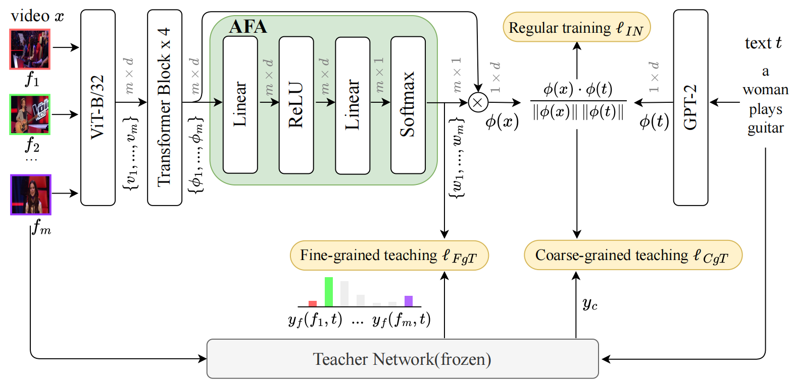

# Holistic Features are almost Sufficient for Text-to-Video Retrieval

The official source code of our CVPR24 paper TeachCLIP, "[Holistic Features are almost Sufficient for Text-to-Video Retrieval](https://www.researchgate.net/publication/379270657_Holistic_Features_are_almost_Sufficient_for_Text-to-Video_Retrieval)".



## Requirement

We used Anaconda to setup a deep learning workspace that supports PyTorch. Run the following script to install all the required packages.

```shell
conda create -n TeachCLIP python==3.8 -y
conda activate TeachCLIP
git clone https://github.com/ruc-aimc-lab/TeachCLIP.git
cd TeachCLIP
pip install -r requirements.txt
```

## How to Run

### data download

Please refer to the guides from [CLIP4Clip: Data Preparing](https://github.com/ArrowLuo/CLIP4Clip?tab=readme-ov-file#data-preparing).

### running scripts

+ For MSRVTT:

  ```shell
  bash scripts/run_teachclip_msrvtt.sh
  ```

+ For MSVD:

  ```shell
  bash scripts/run_teachclip_msvd.sh
  ```

+ For VATEX:

  ```shell
  bash scripts/run_teachclip_vatex.sh
  ```

+ For DiDeMo:

  ```shell
  bash scripts/run_teachclip_didemo.sh
  ```

+ For ActivityNet:

  ```shell
  bash scripts/run_teachclip_actnet.sh
  ```

## Citation

If you find our method useful in your work, please cite:

```python
@inproceedings{teachclip,
    title = {Holistic Features are almost Sufficient for Text-to-Video Retrieval}
    author = {Tian, Kaibin and Zhao, Ruixiang and Xin, Zijie and Lan, Bangxiang and Li, Xirong},
    booktitle={CVPR},
    year = {2024}
}
```


## Acknowledgments

The implementation of TeachCLIP relies on resources from [CLIP4Clip](https://github.com/ArrowLuo/CLIP4Clip "CLIP4Clip"), [X-CLIP](https://github.com/xuguohai/X-CLIP "X-CLIP") and [XPool](https://github.com/layer6ai-labs/xpool "XPool"). We thank the original authors for their open-sourcing.


## Contact

If you encounter any issue when running the code, please feel free to reach us either by creating a new issue in the GitHub or by emailing

- Ruixiang Zhao ([ruixiangzhao@ruc.edu.cn](mailto:ruixiangzhao@ruc.edu.cn))
